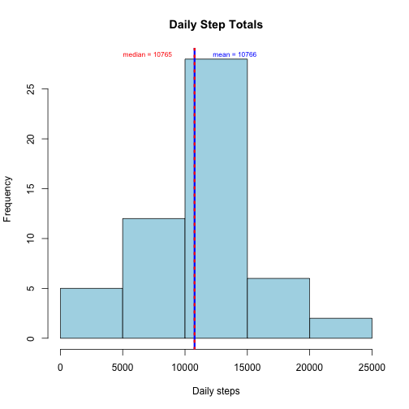
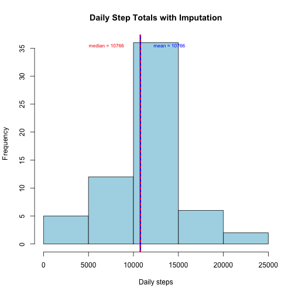
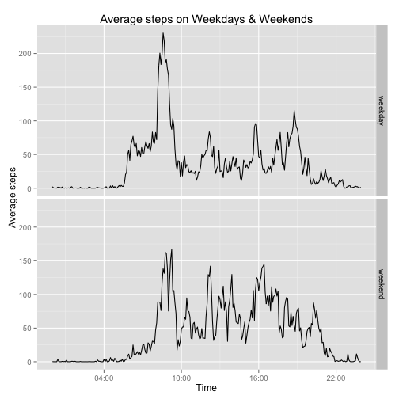

# Reproducible Research: Peer Assessment 1

An investigation of a dataset of personal fitness monitoring data: steps taken 
(aggregated at 5 minute intervals) over the 2-month period of October-November 2012.

## Loading and preprocessing the data
The data are available in a zip file in this repo. 

```r
## Load required packages
library(knitr)
library(ggplot2)
##It is assumed that the repo folder has been set as the working directory. 
activity <- read.csv(unz("activity.zip", "activity.csv"))
## The data are processed so dates are dates and a new column contains complete date and time information. 
activity$date <- as.Date(as.character(activity$date), "%Y-%m-%d")

## convert intervals to times - referring to the start time of the interval
interval2 <- formatC(activity$interval, width = 4, flag = "0")
datetime <- paste(activity$date, interval2, sep = " ")
activity$datetime <- strptime(datetime, "%Y-%m-%d %H%M")
## A character form of the time will also be useful later!
activity$Starttime <- format(as.POSIXct(activity$datetime),format = "%H:%M")
```

## What is mean total number of steps taken per day?
Before starting this exploratory analysis I change the options to show numbers to nearest step, and not in scientific notation. 

```r
options(scipen = 1, digits = 0)
```
The total steps per day are plotted as a histogram (missing data ignored) to give a sense of the range of daily steps.


```r
daysums <- aggregate(steps ~ date, data = activity, sum)
meanday <- mean(daysums$steps)
medianday <- median(daysums$steps)
hist(daysums$steps, col = "lightblue", main = "Daily Step Totals", xlab = "Daily steps")
## Plotting mean and median on the histogram

abline(v = meanday, lwd = 3, lty = 1, col = "blue")
abline(v = medianday, lwd = 3, lty = 3, col = "red")
text(14000, 28.5, paste("mean =", round(meanday, digits = 0)), cex = 0.7, col = "blue")
text(7000, 28.5, paste("median =", medianday), cex = 0.7, col = "red")
```

 

* The mean daily steps taken (ignoring missing values) is 10766.

* The median daily steps taken (ignoring missing values) is 10765.

## What is the average daily activity pattern?

The average step activity in each 5-minute interval over the course of a 24-hour day is plotted (again, missing values are ignored until next section). I've used `mean` rather than `median` for average, to avoid lots of 0's during the night. You could do either. 

Unlike the instructor's plot example for part 5, I've plotted intervals as time rather than integer, because this makes much more sense, and the other way was annoying because time isn't decimal. 


```r
timeMean <- aggregate(steps ~ Starttime, data = activity, mean)
##Get back to a time-date format
timeMean$time <- as.POSIXct(timeMean$Starttime, format = "%H:%M")

plot(timeMean$time, timeMean$steps, type = "l", xlab = "Time", ylab = "Average Steps", main = "Average steps per 5-minute interval", lwd = 3)
```

 

```r
## find 5-min interval with max average
startmax <- timeMean$Starttime[which.max(timeMean$steps)]
stopmax <- timeMean$Starttime[which.max(timeMean$steps)+1]
```
The maximum average activity occurs in the 5-minute interval 08:35 to 08:40.


## Imputing missing values

1. Calculation of number of missing values.

```r
sum(is.na(activity))
```

```
## [1] 2304
```

```r
sum(is.na(activity$steps))
```

```
## [1] 2304
```

```r
percentMissing <- sum(is.na(activity))/nrow(activity)    
```
The two sums are equal, showing that the missing values are all in the `activity$steps` column and that there are 2304 missing. This is equivalent to 13% missing. 

2. Strategy for missing values
To work out how the NAs are distributed, I calculated how `NA`s are distributed by date.

```r
missings <- function(x) sum(is.na(x))
Datemissings <- tapply(activity$steps, activity$date, missings)

kable(as.data.frame(table(Datemissings)), format = "html")
```

<table>
 <thead>
  <tr>
   <th align="left"> Datemissings </th>
   <th align="right"> Freq </th>
  </tr>
 </thead>
<tbody>
  <tr>
   <td align="left"> 0 </td>
   <td align="right"> 53 </td>
  </tr>
  <tr>
   <td align="left"> 288 </td>
   <td align="right"> 8 </td>
  </tr>
</tbody>
</table>
So there are 8 completely missing days and no partly missing days. 
That means we can't impute from neighbouring intervals OR from daily average, so the simplest reasonable option is to use the average for that interval, similar to previous section. 
I looked into whether `mean` or `median` would be better, and found a [handy investigation](http://academic.uprm.edu/eacuna/IFCS04r.pdf) using R, which shows it doesn't really matter. So here `mean` is used. 

3. Actually use the imputation method, create adapted dataset. 

Here a `for` loop is used to check if a steps value is missing, find the average for the relevant time interval, and replace the `NA` with the mean. It's cached for time efficiency.


```r
activityFilled <- activity

for(i in seq_along(activityFilled$steps)) {
        if(is.na(activityFilled$steps[i])) {
                start <- activityFilled$Starttime[i]
                filler <- mean(activityFilled$steps[activityFilled$Starttime == start], na.rm = TRUE)
                activityFilled$steps[i] <- filler
        } 
}
## Check for missing values
sum(is.na(activityFilled))
```

```
## [1] 0
```

4. A histogram analogous to part 1 but with missing values imputed. 
We wouldn't expect much different in mean and median if the mean is used to fill in missing values, so this should be pretty similar to Part 1!


```r
daysums2 <- aggregate(steps ~ date, data = activityFilled, sum)
meanday <- mean(daysums2$steps)
medianday <- median(daysums2$steps)
hist(daysums2$steps, col = "lightblue", main = "Daily Step Totals with Imputation", xlab = "Daily steps")
## Plotting mean and median on the histogram

abline(v = meanday, lwd = 3, lty = 1, col = "blue")
abline(v = medianday, lwd = 3, lty = 3, col = "red")
text(14000, 35.5, paste("mean =", round(meanday, digits = 0)), cex = 0.7, col = "blue")
text(7000, 35.5, paste("median =", round(medianday, digits = 0)), cex = 0.7, col = "red")
```

 


* The mean daily steps taken (ignoring missing values) is 10766.

* The median daily steps taken (ignoring missing values) is 10766.

As  seen in comparison to the first plot, the frequency of the 10000-15000 step "bucket" is higher because all of the missing days have fallen in there, median now aligns with the mean (as there are 8 days with that value, falling in the middle of the distribution) and mean has not changed at all (because it was used in imputing). 


## Are there differences in activity patterns between weekdays and weekends?

The aim here is to show interval means over time for weekdays and weekends. 
First, days of the week are assigned and a new column in the `activityFilled` dataframe gives a 2-level factor of "weekend" and "weekday". 

```r
activityFilled$day <- weekdays(activityFilled$date)
weekend <- c("Saturday", "Sunday")
activityFilled$weekday <- character(length = nrow(activityFilled))
activityFilled$weekday[activityFilled$day %in% weekend] <- "weekend"
activityFilled$weekday[!activityFilled$day %in% weekend] <- "weekday"
activityFilled <- transform(activityFilled, weekday = factor(weekday))
```

The next step is to make a panel plot of a time series plot for averages of steps within 5-minute intervals across weekdays and weekends. This has been done here by aggregation first and then plotting using the `ggplot2` package. 

```r
dayMean <- aggregate(steps ~ Starttime + weekday, data = activityFilled, mean)
## Create a date format variable for plotting, again.
dayMean$Time <- as.POSIXct(dayMean$Starttime, format = "%H:%M")
```
The `dayMean` aggregated data are then plotted. 

```r
library(scales) ## Needed for formatting x axis times
p <- qplot(Time, steps, facets = weekday~., data=dayMean, geom = "line", ylab = "Average steps", main = "Average steps on Weekdays & Weekends")
p + scale_x_datetime(breaks = date_breaks("6 hour"), labels = date_format("%H:%M"))
```

 

As shown on the plot, there is some difference worth investigating between Weekends and Weekdays - the day starts somewhat later and more slowly on the weekends and there is more activity later at night. This makes sense - though it could be useful to define "weekend" as say Friday evening to Sunday evening and investigate, and to do a cumulative daily count. 

To get the markdown and html format documents, the `knitr` library is used to run the following code:

`knit2html("PA1_template.Rmd")` 
(not run here, for recursion reasons). 

